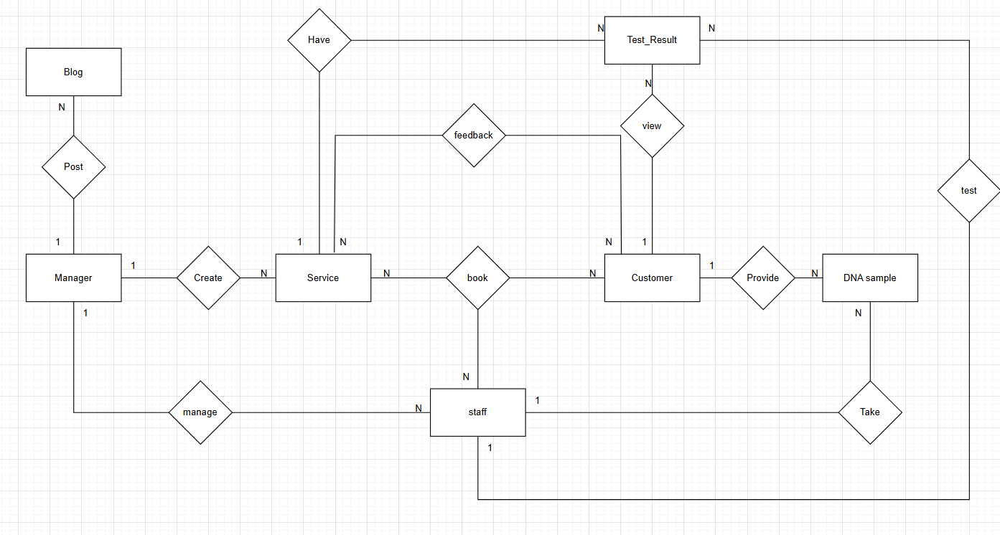

## 	User Requirements
2.1	Guest
-	Goal: 	
	+ Learn about the services available on the system
+ Register an account to use the service
-	Task:
+  View information about different types of DNA tests
+  Schedule a consultation and communicate with staff
+  Enter user information to register
2.2	Customer:
-	Goal:
+  Register for DNA testing services
+  Track the testing progress
+  View test results
+  Manage profile and history
-	Staff
+  Select the type of test, sample collection method, fill in information, and schedule an appointment
+  View sample processing status and notifications from the system
+  Log in and access the test results section
+  View, update profile, and look up test history
+  Rate the service
2.3	Staff:
-	Goal:
+  Perform tasks related to sample collection and DNA testing
+  Enter data and manage customer information/test results
+  Provide consultation to customers
-	Task:
+  Add, edit, and search for customer information
+  Create consultation and testing appointments
+  View the list of customer sample collection appointments
+  Update the testing progress status
+  Enter test results into the system
+  Respond to customer questions or support requests via the system
2.4	Manager:
-	Goal:
+  Ensure the testing process is carried out on schedule and with high quality
+  Enhance customer experience through managing feedback and reviews
+  Monitor the operational efficiency of the testing service at the facility
+  Manage testing services (pricing, procedures, service information)
-	Task:
+  Monitor the progress of each DNA test case at the medical facility
+  Review test results uploaded to the system
+  View and analyze customer feedback
+  Manage testing service information: update descriptions, pricing, and procedures
+  Access dashboards and reports to evaluate overall operations
2.5	Admin:
-	Goal:
+  Administer the entire DNA testing software system of the medical facility
+  Ensure the system operates stably and is properly configured
+  Manage users and assign appropriate access permissions
+  Monitor and support other departments during system operations
-	Task:
+  Configure the system, including the homepage, service list, and user guides
+  Manage system users: create, edit, and delete accounts (Guest, Customer, Staff, Manager)
+  Assign usage rights and restrict functionalities according to each user type
+  Monitor and oversee the entire testing process within the system
+  View and export overall system statistics from the Dashboard

## Concept Diagram

📊 [View system diagram on Draw.io](https://app.diagrams.net/#G1SKFOfrTQoccVk-UzYPPtAwg7NVrxOUnJ#%7B%22pageId%22%3A%22a6mbGnwGvX9pmkE2TlM8%22%7D)

## APIs List

### Authorization:
1. **POST**: `/api/auth/login` (User login)
2. **POST**: `/api/auth/register` (Register a new account)
3. **POST**: `/api/auth/logout` (Logout)
4. **POST**: `/api/auth/refresh` (Refresh access token)

### Users API:
1. **GET**: `/api/users` (Retrieve list of users (Admin))
2. **POST**: `/api/users` (Create a new user (Admin))
3. **GET**: `/api/users/{id}` (Retrieve user information by ID)
4. **PUT**: `/api/users/{id}` (Update user information)
5. **DELETE**: `/api/user/{id}` (Delete user)
6. **GET**: `/api/users/profile` (View current user's information)

### Services API:
1. **GET**: `/api/services` (Retrieve list of services)
2. **POST**: `/api/service` (Create a new service (Admin))
3. **GET**: `/api/services/{id}` (Retrieve service information by ID)
4. **PUT**: `/api/services/{id}` (Update service (Admin))
5. **DELETE**: `/api/services/{id}` (Delete service (Admin))

### Appointments API:
1. **GET**: `/api/appointments` (Retrieve list of appointments)
2. **POST**: `/api/appointments` (Create a new appointment)
3. **GET**: `/api/appointments/{id}` (Retrieve appointment information by ID)
4. **PUT**: `/api/appointments/{id}` (Update appointment)
5. **DELETE**: `/api/appointments/{id}` (Delete appointment)
6. **GET**: `/api/appointments/schedule` (Retrieve available schedule for booking)

### Samples API:
1. **GET**: `/api/samples` (Retrieve list of test samples)
2. **POST**: `/api/samples` (Create a new test sample)
3. **GET**: `/api/samples/{id}` (Retrieve test sample information by ID)
4. **PUT**: `/api/samples/{id}` (Update test sample)
5. **GET**: `/api/samples/tracking` (Track sample status)

### Results API:
1. **GET**: `/api/results` (Retrieve list of results)
2. **POST**: `/api/results` (Create a new result (Lab))
3. **GET**: `/api/results/{id}` (Retrieve result information by ID)
4. **PUT**: `/api/results/{id}` (Update result (Lab))
5. **DELETE**: `/api/results/{id}/download` (Download result file PDF)

### Reviews API:
1. **GET**: `/api/reviews` (Retrieve list of reviews)
2. **POST**: `/api/reviews` (Create a new review)
3. **GET**: `/api/reviews/{id}` (Retrieve review details)
4. **PUT**: `/api/reviews/{id}` (Update review)
5. **DELETE**: `/api/reviews/{id}` (Delete review)

### Notifications API: (Optional)
1. **GET**: `/api/notifications` (Retrieve list of notifications)
2. **POST**: `/api/notifications` (Create a new notification (System))
3. **PUT**: `/api/notifications/{id}` (Mark notification as read)

### Admins API:
1. **GET**: `/api/admin/dashboard` (Retrieve admin dashboard statistics)
2. **GET**: `/api/admin/reports` (Retrieve statistical reports)
3. **GET**: `/api/admin/services` (Manage services (Admin))

### Payments API:
1. **GET**: `/api/payments` (Retrieve list of payments)
2. **POST**: `/api/payments` (Create a new payment)
3. **GET**: `/api/payments/{id}` (Retrieve payment details)
4. **POST**: `/api/payments/{id}/confirm` (Confirm payment)

